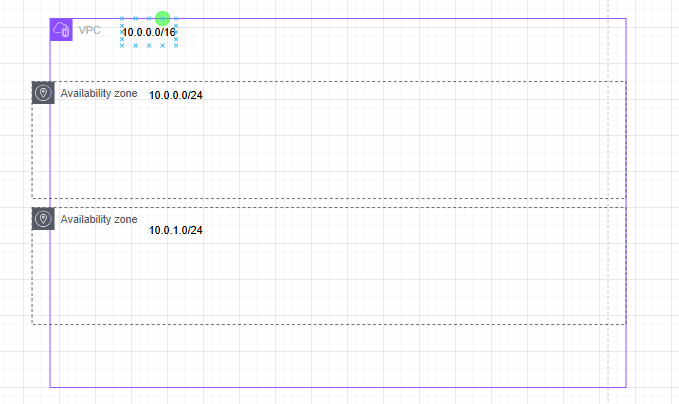

Assignment Question :

create a public and private subnet per each AZ available  in one region ( Thai ) 
All public subnets must associtaed with one public RTB/All private subnets must associated with one private RTB
create a variable.tf and declare all variable  in that file
Create terraform.tfvars or production.tfvars  and set variable values in that file.

PS : Step // Create VPC 
          //Create Internet Gateway 
         //Attach Internet gateway to VPC 
         //Creat one public subnet per each zone 
         // Create a public routing table and associate it with all public subnets

         // object //list

     Step // variable 
           without default >> user input 
           deafult = "something"

           terraform apply -var my_vpc_name="something"
           terraform apply --var-file production.tfvars

           Create production.tfvars 

     Step // count 
          0 ,              1 ,        2, --------------> dafault ( ap-southeast-7a,ap-southeast-7b,ap-southeast-7c) 
        1a  ,             1b,         1c,----------------> zone
        "10.0.0.0/24"  "10.0.1.0/24"  "10.0.2.0/24"------->cidr
        "my_subnet1"    "my_subnet2"    "my_subnet3"------>subnetname 

        